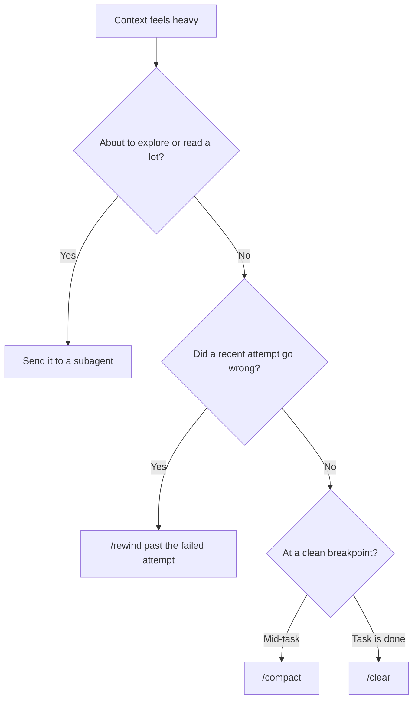

# Context engineering

A rundown of what context rot actually is, and the concrete moves you have against it in Claude Code.

## Why it happens

The model is stateless. Every call starts empty, and the harness rebuilds your entire conversation from a saved transcript and pastes it back in. That transcript is the model's whole observable world for that call. If something isn't in it, it doesn't exist, and if something is in it, it gets read and re-weighed on every single turn, forever.

Two properties of the model make this expensive as the transcript grows:

- **Generation is autoregressive.** Each token is predicted from everything before it, and each new token then becomes input for the next prediction. A small difference early in the context compounds across a long response.
- **Attention is finite.** Every token in the window competes for the same fixed attention budget. Double the tokens and, on average, every existing token gets roughly half the weight it had before.

Anthropic's own writing on this calls the resulting quality drop "context rot": accuracy degrades as context grows, and it starts from the first added token rather than kicking in past some threshold. Models also tend to track the start and end of a long context better than the middle, so something important buried in the middle of a long dump is the most likely thing to get skimmed past.

## How it shows up

- **Instructions get ignored** even though they're still sitting in the window. The words didn't disappear, they just stopped getting enough attention to change the output.
- **Answers quietly get worse** for the same question, with no error and no warning.
- **Bad state gets stuck.** A hallucinated fact, a stale plan, a wrong file read: once it's in the transcript it's read again on every turn, and a degraded response based on it becomes more bad context for the next turn.

Quantity (rot) and quality (pollution) are different problems. A short, wrong, confident-sounding paragraph can do more damage than a long correct one, because it reads as important and the model has no way to flag it as false. This is usually self-inflicted, not adversarial: an earlier hallucination, an assumption that turned out wrong, a debugging loop that never got resolved.

## The levers

None of this requires new tooling. Claude Code already ships the pieces:

| Lever | What it does | Reach for it when |
|---|---|---|
| Subagent | Runs exploration in its own context window and reports back only the conclusion | You're about to read more than you need to keep, especially in unfamiliar code |
| `/rewind` | Restores a checkpoint: code and conversation together, conversation only, or code only | A recent attempt failed and you don't want its aftermath shaping the next one |
| `/compact` | Summarizes the current conversation in place and keeps going | You've hit a clean breakpoint mid-task and want headroom without starting over |
| `/clear` | Full reset to an empty conversation | The current task is done and the next one doesn't need this history |

A close cousin of `/rewind` and `/clear` is doing the same thing by hand: copy the parts of the conversation worth keeping into a file or your clipboard, clear or rewind, and paste them back in as the opening message. It's brute force, but it works, and it turns transient context into a durable artifact you can reuse across sessions.

Roughly order them from least to most disruptive. Subagents and `/rewind` are cheap enough to reach for early and often, before a session gets anywhere near full. `/compact` and `/clear` throw away more, so save them for a real breakpoint rather than a mid-task reflex.

## The balance

This isn't a case for stripping everything out. Cut too aggressively and the model fills the gaps with assumptions, which is its own source of hallucination. The goal is information density: keep what the model actually needs for the next step, and route everything else (exploration, failed attempts, finished work) out of the window instead of letting it accumulate.

It's also worth checking your baseline before a session even starts. `/context` (see the General section) shows what's already loaded before you've typed a word, and trimming unused MCP tools or setting rarely-used skills to manual invocation (see the Mcp and Skill sections) keeps that baseline small in the first place.

Reference: [Effective context engineering for AI agents](https://www.anthropic.com/engineering/effective-context-engineering-for-ai-agents), [Checkpointing](https://code.claude.com/docs/en/checkpointing)
